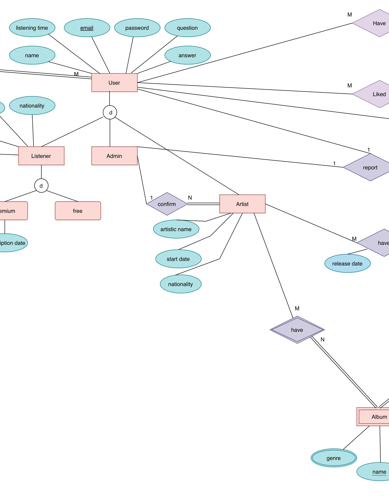

# Music-Sharing-Social-Network
For the database course project we presented an API for a streaming music service provider (like Spotify) using Python, Flask, and MySQL.

The diagram below shows the [ER]("ER.pdf") model of our database.

